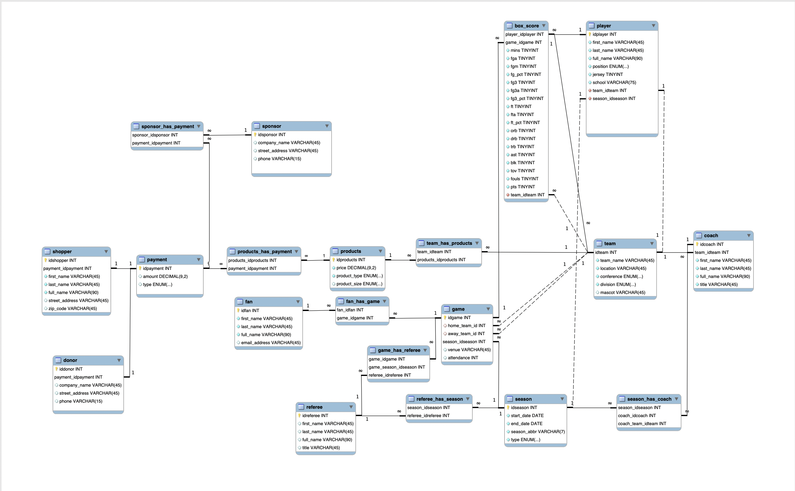

# NBJA Database </img>
**Matthew Frazier** 
University of Delaware 
CISC 637 Database Systems 
Fall 2019

### Overview
This project proposes a database for a fictional basketball league, the National Junior Basketball Association (NJBA).

#### Documentation
Details on the concept of the NJBA league is in the /docs folder:
* Presentation.pdf
  - Powerpoint bullet presentation of the NJBA that outlines its core competencies.
* Proposal.pdf
  - A paper that surveys the industry standard and proposes the need for the league.
* User-Stories.pdf
  - Focused user stories that outline the vision of the UI for the NJBA application.

#### Database Design

#### Requirements
1. **MySQL:** [Download and install MySQL server here](https://dev.mysql.com/downloads/)
2. **Python 3:** [Download and install Python 3 here](https://www.python.org/downloads/)

#### Dependencis
**PyPi libraries:**
  - [Names](https://pypi.org/project/names/)
  - [Pandas](https://pypi.org/project/pandas/)
> pip install names 
> pip install pandas 
>
  
        
### Running the Project
Create a python virtual environment
> virtualenv -p python3 .

Launch the Python virutal environment
> source ./bin/activate

 

#### Addtional Information
**Payment Mapping** 
Donors  = 1      through 339457 
Sponsor = 339458 through 399999 
Shopper = 340000 through 5000000 
