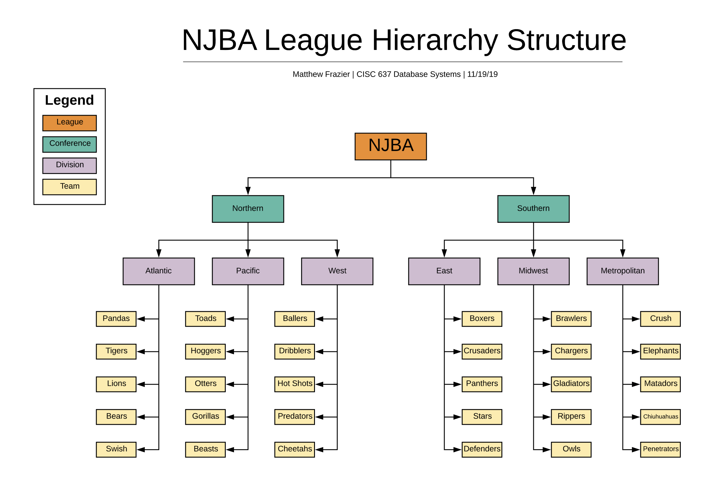

# NBJA Database </img>
**Matthew Frazier** 
University of Delaware 
CISC 637 Database Systems 
Fall 2019

## Folders
* [Database Design Model Images](/models)
* [CSV and Images for all Query Plan (Reporting, Analytics, and Optimization)](/Reporting-and-Analytics)
 
#### Additional Files
Details on the concept of the NJBA league is in the /docs folder:
* [MySQL Workbench Database File](njba.mwb)
  - Builds the database with MySQL Workbench client.
* [MySQL Workbench Database File (Backup)](njba.mwb.bak)
  - Backup of MySQL Workbench Database File.
* [Team Hierachy](njba-team-hierarchy.png)
  - Used for recursive querying for Team Hierarchy.
 
